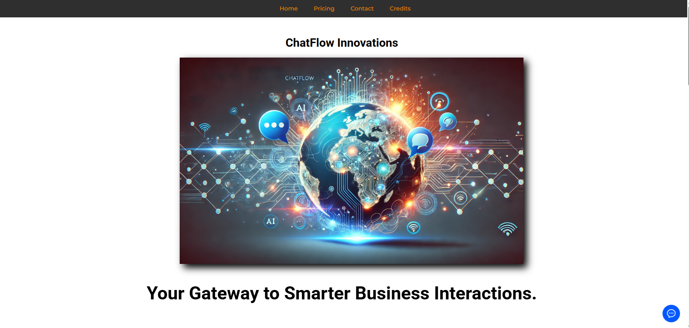
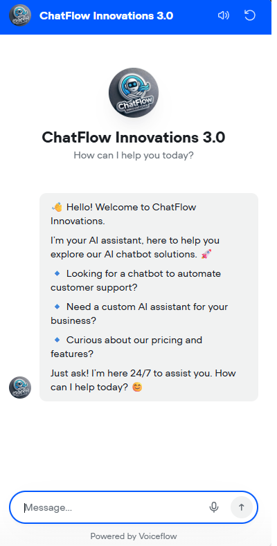
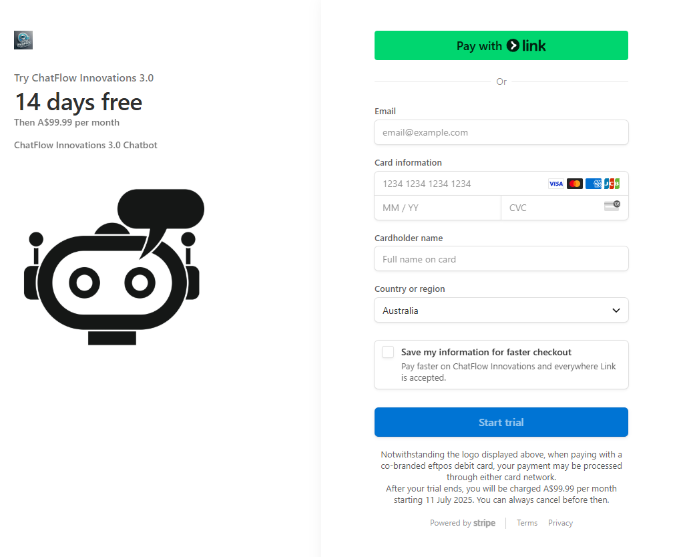

This is the marketing website for ChatFlow Innovations, a B2B chatbot solution built with Voiceflow. The website includes:

✅ A support chatbot integrated with JavaScript
✅ A demo video showcasing core features
✅ A fully-integrated Stripe payment portal

⚠️ **Note:** Not currently deployed to Google Cloud. Please download the `.zip` file, extract, and open in your IDE or local server to view.

---

## 🚀 Features
- Modern, responsive marketing landing page
- Embedded support chatbot powered by Voiceflow
- Secure Stripe checkout flow for purchasing subscriptions
- Demo video walkthrough of the chatbot product
- Contact form and business details

---

## 🛠 Tech Stack
- HTML5 / CSS3 / JavaScript
- Stripe Checkout API
- Voiceflow chatbot integration

---

## 🧩 Installation

1️⃣ **Download the repository:**
```bash
git clone https://github.com/Alex-King-1998/chatflow-innovations.git
```
or download the .zip and extract it.

**2️⃣ Open the project:**

- Using your IDE (e.g., VS Code)
- Or open `index.html` in your browser

✅ Note: Some features (like Stripe) may require server-side handling in production environments.

---

## 💳 Stripe Payment Integration
This project includes a fully working Stripe payment portal:

- Test keys and environment used for development
- Example credit card numbers for sandbox testing
- Checkout flow demonstration

👉 Important: Replace test keys with your live keys before deploying.

---

## ✨ Screenshots

<p align="center">
  
</p>

<p align="center">
  
</p>

<p align="center">
  
</p>

## 📹 Demo Video

[▶️ Watch the demo video on YouTube](https://www.youtube.com/watch?v=LziDWWPdJ38)

